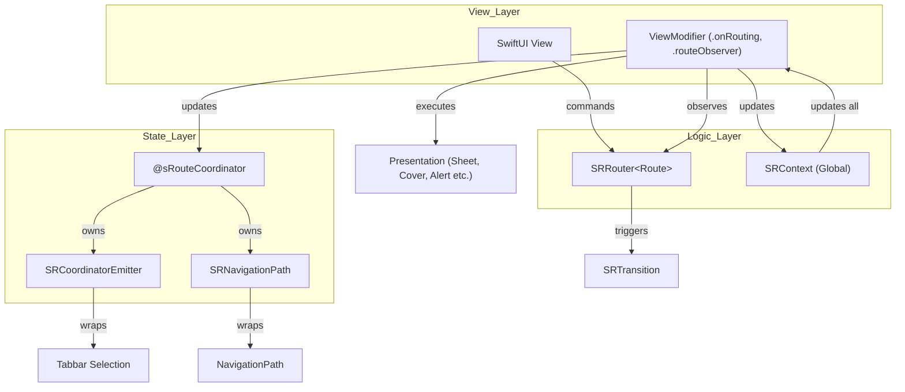

# sRouting Development Skill

This skill provides step-by-step instructions for setting up the `sRouting` framework and adding new screens to a SwiftUI application.

## Architecture Overview

The following diagram illustrates the core components of the `sRouting` framework and their interactions.



## AI Context Guidance

To quickly understand the context of an `sRouting` implementation, follow this research path:

1.  **Entry Point**: Look for `@main` and `SRRootView` to find the `SRContext` and the initial `AppCoordinator`.
2.  **Coordinator**: Examine the class annotated with `@sRouteCoordinator`. This reveals the tabs, navigation stacks, and mapping.
3.  **Routes**: Identify `@sRoute` or `@sRoutePath` enums. These are the source of truth for screens.
4.  **Navigation Logic**: Find `SRRouter` instances in Views and check `@sRouteObserver` for destination handling.

---

## 1. Core Concepts & Macros

`sRouting` uses several macros to reduce boilerplate and enforce best practices:

- **`@sRoute`**: Automatically implements `SRRoute` protocol, generates a `Paths` enum for navigation, and provides a `path` property.
- **`@sRoutePath`**: Similar to `@sRoute` but allows you to manually conform to `SRRoute`. Useful if you need custom logic or specific Actors.
- **`@sSubRoute`**: Used inside a Route enum to indicate that a case represents a nested route (e.g., `case detail(DetailRoute)`).
- **`@sRouteCoordinator`**: Generates properties for navigation paths and tab selections. It makes your class conform to `SRRouteCoordinatorType`.
- **`@sRouteObserver`**: Generates a `ViewModifier` that handles the navigation destinations for routes.

---

## 2. Setting Up sRouting

### Step 1: Define Your Coordinator
Create a coordinator class to manage the global navigation state.

```swift
import sRouting
import Observation

@sRouteCoordinator(tabs: ["home", "settings"], stacks: "home", "settings")
@Observable
final class AppCoordinator { }
```

### Step 2: Configure App Entry Point
Initialize `AppCoordinator` and `SRContext` in your main App struct.

```swift
@main
struct MyApp: App {
    @State private var appCoordinator = AppCoordinator()
    @State private var context = SRContext()

    var body: some Scene {
        WindowGroup {
            SRRootView(context: context, coordinator: appCoordinator) {
                SRSwitchView(startingWith: AppRoute.startScreen)
            }
        }
    }
}
```

> [!IMPORTANT]
> `SRRootView` must be the root of your navigation hierarchy to enable deep linking and global navigation actions.

---

## 3. Implementing TabBar & Navigation

### Define a Route Observer
Register your route enums to handle their navigation destinations.

```swift
@sRouteObserver(HomeRoute.self, SettingsRoute.self)
struct RouteObserver: ViewModifier { }
```

### Create the TabBar View
Use `coordinator.emitter.tabSelection` for tab binding and apply `.routeObserver` to each `NavigationStack`.

```swift
struct MainTabbarView: View {
    @Environment(AppCoordinator.self) var coordinator

    var body: some View {
        @Bindable var emitter = coordinator.emitter
        TabView(selection: $emitter.tabSelection) {
            NavigationStack(path: coordinator.homePath) {
                HomeView()
                    .routeObserver(RouteObserver.self)
            }
            .tag(AppCoordinator.SRTabItem.homeItem)
            .tabItem { Label("Home", systemImage: "house") }

            NavigationStack(path: coordinator.settingsPath) {
                SettingsView()
                    .routeObserver(RouteObserver.self)
            }
            .tag(AppCoordinator.SRTabItem.settingsItem)
            .tabItem { Label("Settings", systemImage: "gear") }
        }
    }
}
```

---

## 4. Navigation Actions (SRRouter)

Use `SRRouter` inside your views to trigger transitions.

### Basic Navigation
- `router.trigger(to: .detail, with: .push)`: Push a new screen.
- `router.trigger(to: .profile, with: .sheet)`: Present a sheet.
- `router.trigger(to: .login, with: .present)`: Present a full-screen cover.
- `router.dismiss()`: Dismiss the current modal or pop the top view.
- `router.pop()`: Pop one level in the current stack.
- `router.popToRoot()`: Pop all the way to the root of the current stack.

### Advanced Actions
- `router.show(alert: .error("Msg"))`: Show an alert (requires `AlertRoute` typealias in your Route enum).
- `router.show(dialog: .confirm)`: Show a confirmation dialog.
- `router.show(popover: .info)`: Show a popover.
- `router.selectTabbar(at: .home)`: Programmatically switch tabs.
- `router.switchTo(route: AppRoute.mainTabbar)`: Reset the root view (e.g., after login).
- `router.dismissAll()`: Dismiss all modals and reset path.

---

## 5. Advanced Features

### Nested Sub-routes
Organize complex navigation by nesting routes.

```swift
@sRoute
enum HomeRoute {
    case main
    @sSubRoute case detail(DetailRoute)

    var screen: some View {
        switch self {
        case .main: HomeView()
        case .detail(let route): route.screen
        }
    }
}
```

### Deep Linking & Global Routing
Use `SRContext` to perform navigation from anywhere (e.g., in response to a push notification).

```swift
await context.routing(
    .select(tabItem: .home),
    .push(route: HomeRoute.detail(.info))
)
```

### Multiple Coordinators
Present a new flow with its own coordinator (e.g., a multi-step onboarding).

```swift
// In your view
router.openCoordinator(route: OnboardingRoute.start, with: .present)

// In your root view
SRRootView(...) { ... }
.onRoutingCoordinator(OnboardingRoute.self, context: context)
```
