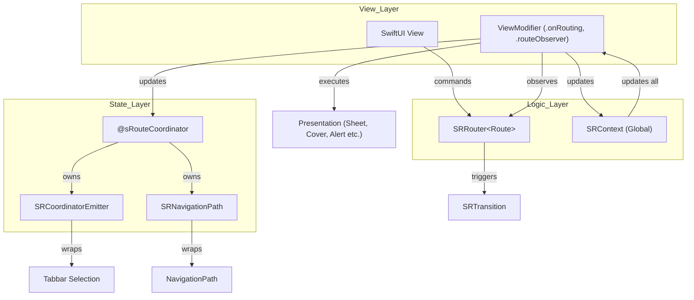

# sRouting Development

Defines route enums, configures coordinators, and wires NavigationStack-based navigation for SwiftUI apps using the `sRouting` framework.

## Architecture Overview


```mermaid
graph TD
    subgraph View_Layer
        V["SwiftUI View"]
        VM["ViewModifier (.onRouting, .routeObserver)"]
    end

    subgraph Logic_Layer
        SRR["SRRouter&lt;Route&gt;"]
        SRC["SRContext (Global)"]
    end

    subgraph State_Layer
        COORD["@sRouteCoordinator"]
        EMIT["SRCoordinatorEmitter"]
        PATH["SRNavigationPath"]
    end

    V -- "commands" --> SRR
    SRR -- "triggers" --> TR["SRTransition"]
    VM -- "observes" --> SRR
    VM -- "updates" --> SRC
    COORD -- "owns" --> EMIT
    COORD -- "owns" --> PATH
    PATH -- "wraps" --> SWPATH["NavigationPath"]
    VM -- "executes" --> SWNAV["Presentation (Sheet, Cover, Alert etc.)"]
    VM -- "updates" --> COORD
    EMIT --"wraps" --> TBS["Tabbar Selection"]
    SRC --"updates all" --> VM     
```

## AI Context Guidance

To understand an existing `sRouting` implementation, follow this research path:

1. **Entry Point**: Find `@main` and `SRRootView` — reveals the `SRContext` and root `AppCoordinator`.
2. **Coordinator**: Inspect the `@sRouteCoordinator` class — shows tabs, navigation stacks, and mapping.
3. **Routes**: Find `@sRoute` or `@sRoutePath` enums — these are the source of truth for screens.
4. **Navigation Logic**: Locate `SRRouter` instances in Views and check `@sRouteObserver` for destination handling.

For implementation details, see `Sources/sRouting/Models/` (SRRouter, SRContext, SRNavigationPath) and `Sources/sRoutingMacros/` (macro definitions).

---

## 1. Core Concepts & Macros

| Macro | Purpose |
|-------|---------|
| `@sRoute` | Implements `SRRoute` protocol, generates `Paths` enum and `path` property |
| `@sRoutePath` | Like `@sRoute` but allows manual `SRRoute` conformance for custom logic |
| `@sSubRoute` | Marks a case as a nested route (e.g., `case detail(DetailRoute)`) |
| `@sRouteCoordinator` | Generates navigation path and tab selection properties, conforms to `SRRouteCoordinatorType` |
| `@sRouteObserver` | Generates a `ViewModifier` that handles navigation destinations |

---

## 2. Setting Up sRouting

### Step 1: Define the Coordinator

```swift
import sRouting
import Observation

@sRouteCoordinator(tabs: ["home", "settings"], stacks: "home", "settings")
@Observable
final class AppCoordinator { }
```

### Step 2: Configure App Entry Point

```swift
@main
struct MyApp: App {
    @State private var appCoordinator = AppCoordinator()
    @State private var context = SRContext()

    var body: some Scene {
        WindowGroup {
            SRRootView(context: context, coordinator: appCoordinator) {
                SRSwitchView(startingWith: AppRoute.startScreen)
            }
        }
    }
}
```

> [!IMPORTANT]
> `SRRootView` must be the root of your navigation hierarchy to enable deep linking and global navigation actions.

**Checkpoint**: Build and run — the app should launch without errors and display the initial screen from `SRSwitchView`.

---

## 3. Implementing TabBar & Navigation

### Define a Route Observer

```swift
@sRouteObserver(HomeRoute.self, SettingsRoute.self)
struct RouteObserver { }
```

### Create the TabBar View
Use `coordinator.emitter.tabSelection` for tab binding and apply `.routeObserver` to each `NavigationStack`.

```swift
struct MainTabbarView: View {
    @Environment(AppCoordinator.self) var coordinator

    var body: some View {
        @Bindable var emitter = coordinator.emitter
        TabView(selection: $emitter.tabSelection) {
            NavigationStack(path: coordinator.homePath) {
                HomeView()
                    .routeObserver(RouteObserver.self)
            }
            .tag(AppCoordinator.SRTabItem.homeItem)
            .tabItem { Label("Home", systemImage: "house") }

            NavigationStack(path: coordinator.settingsPath) {
                SettingsView()
                    .routeObserver(RouteObserver.self)
            }
            .tag(AppCoordinator.SRTabItem.settingsItem)
            .tabItem { Label("Settings", systemImage: "gear") }
        }
    }
}
```

**Checkpoint**: Build and run — tabs should appear and switching between them should work. Each tab's content view should render.

---

## 4. Navigation Actions (SRRouter)

### Basic Navigation
- `router.trigger(to: .detail, with: .push)`: Push a new screen.
- `router.trigger(to: .profile, with: .sheet)`: Present a sheet.
- `router.trigger(to: .login, with: .present)`: Present a full-screen cover.
- `router.dismiss()`: Dismiss the current modal or pop the top view.
- `router.pop()`: Pop one level in the current stack.
- `router.popToRoot()`: Pop all the way to the root of the current stack.

### Advanced Actions
- `router.show(alert: .error("Msg"))`: Show an alert (requires `AlertRoute` typealias in your Route enum).
- `router.show(dialog: .confirm)`: Show a confirmation dialog.
- `router.show(popover: .info)`: Show a popover.
- `router.selectTabbar(at: .home)`: Programmatically switch tabs.
- `router.switchTo(route: AppRoute.mainTabbar)`: Reset the root view (e.g., after login).
- `router.dismissAll()`: Dismiss all modals and reset path.

---

## 5. Advanced Features

### Nested Sub-routes
Organize complex navigation by nesting routes.

```swift
@sRoute
enum HomeRoute {
    case main
    @sSubRoute case detail(DetailRoute)

    var screen: some View {
        switch self {
        case .main: HomeView()
        case .detail(let route): route.screen
        }
    }
}
```

### Deep Linking & Global Routing
Use `SRContext` to perform navigation from anywhere (e.g., in response to a push notification).

```swift
await context.routing(
    .select(tabItem: .home),
    .push(route: HomeRoute.detail(.info))
)
```

### Multiple Coordinators
Present a new flow with its own coordinator (e.g., a multi-step onboarding).

```swift
// In your view
router.openCoordinator(route: OnboardingRoute.start, with: .present)

// In your root view
SRRootView(...) { ... }
.onRoutingCoordinator(OnboardingRoute.self, context: context)
```

---

## 6. Troubleshooting

| Symptom | Cause | Fix |
|---------|-------|-----|
| Navigation push does nothing | Missing `.routeObserver(RouteObserver.self)` on the `NavigationStack` content | Add `.routeObserver(RouteObserver.self)` to the root view inside each `NavigationStack` |
| Deep linking fails silently | `SRRootView` is not the root of the view hierarchy | Ensure `SRRootView` wraps the entire app content in the `@main` struct |
| Tab selection binding has no effect | Using wrong tag type | Use `AppCoordinator.SRTabItem` enum values as tags, not raw strings |
| Sheet or alert does not appear | Route enum missing `AlertRoute` or `DialogRoute` typealias | Add the required typealias to the route enum (e.g., `typealias AlertRoute = MyAlertRoute`) |
